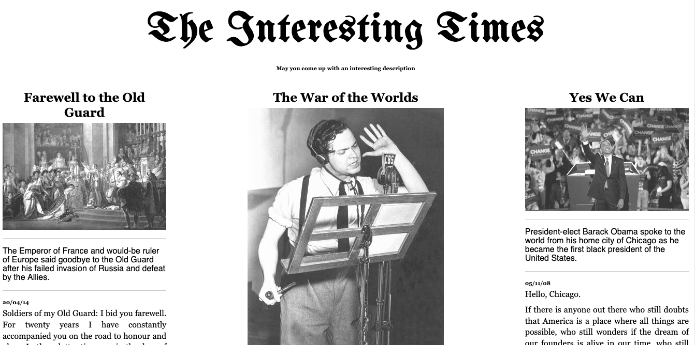

# The Interesting Times - Jekyll Theme

[Live Demo](https://alvaroduran.com/the-interesting-times) &nbsp; | &nbsp; [Download](https://github.com/ohduran/the-interesting-times/archive/master.zip) &nbsp; | &nbsp; [Support me on Patreon](https://patreon.com/alvaroduran)

### Copyright

Copyright (C) 2019 Alvaro Duran, https://www.alvaroduran.com

**The Interesting Times theme for Jekyll** is designed and developed by [Alvaro](https://alvaroduran.com) and it is *free* under MIT license.

<a href="https://www.wowthemes.net/donate/" target="_blank"><svg style="height: auto !important;width: auto !important;" xmlns="http://www.w3.org/2000/svg" x="0px" y="0px"
width="24" height="24"
viewBox="0 0 172 172"
style=" fill:#000000;"><g fill="none" fill-rule="nonzero" stroke="none" stroke-width="1" stroke-linecap="butt" stroke-linejoin="miter" stroke-miterlimit="10" stroke-dasharray="" stroke-dashoffset="0" font-family="none" font-weight="none" font-size="none" text-anchor="none" style="mix-blend-mode: normal"><path d="M0,172v-172h172v172z" fill="none"></path><g fill="#e74c3c"><path d="M14.33333,21.5v129h28.66667v-129zM107.5,21.5c-27.65617,0 -50.16667,22.5105 -50.16667,50.16667c0,27.65617 22.5105,50.16667 50.16667,50.16667c27.65617,0 50.16667,-22.5105 50.16667,-50.16667c0,-27.65617 -22.5105,-50.16667 -50.16667,-50.16667z"></path></g></g></svg>Support me on Patreon</a>

### Contribute

1. [Fork the repo](https://github.com/ohduran/the-interesting-times).
2. Clone a copy of your fork on your local
3. Create a branch off of master and give it a meaningful name (e.g. my-new-feature).
4. Make necessary changes, commit, push and open a pull request on GitHub.

Thank you!
